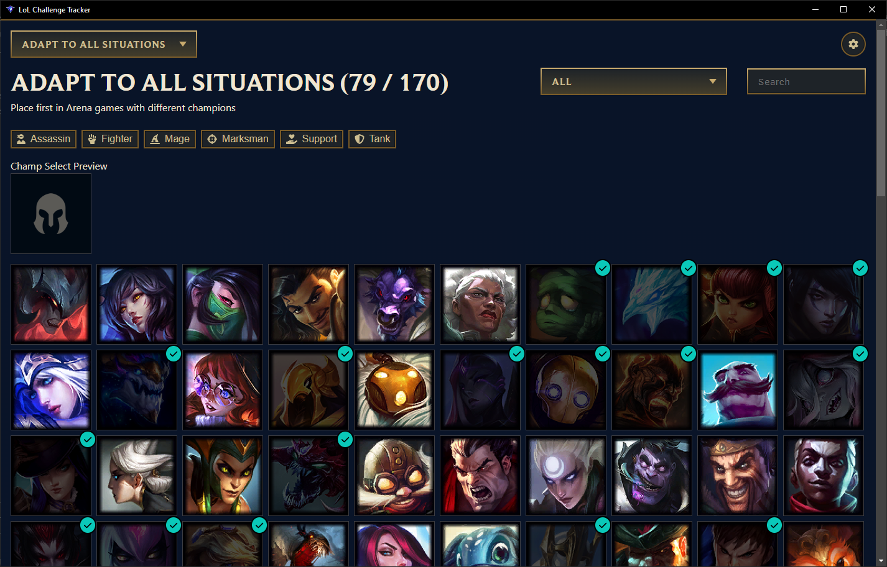

# LoL Challenge Tracker

> A simple app to see the advancement of League of Legends challnges where you need to track champions.



# How to use

It's better to launch the LoL client before

> An error popup could appear in some rare cases, you can safely ignore it

# Install (Windows only)

Go to the [latest release](https://github.com/nyquase/lol-challenge-tracker/releases/latest)

> Windows will warn you that this exe is not safe, because it's a pain to sign an exe. Feel free to look at the code to see what it does.

# Build

```sh
npm install
```

Try in dev mode

```sh
npm run dev
```

Build for release

```sh
npm run build
```
